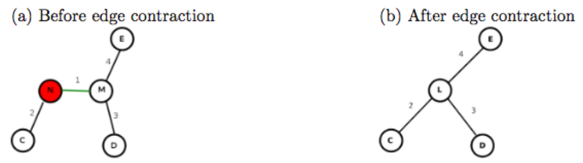

# Concurrent Programing Java
This repository contains projects submitted as a course for the Concurrent Programming in Java Specialization.


## 1.1 Java Threads
**Lecture Summary:** In this lecture, we learned the concept of threads as lower-level building blocks for concurrent programs. A unique aspect of Java compared to prior mainstream programming languages is that Java included the notions of threads (as instances of the ```java.lang.Thread``` class) in its language definition right from the start.

When an instance of ```Thread``` is created (via a ```new``` operation), it does not start executing right away; instead, it can only start executing when its ```start()``` method is invoked. The statement or computation to be executed by the thread is specified as a parameter to the constructor.

The Thread class also includes a wait operation in the form of a ```join()``` method. If thread ```t0``` performs a ```t1.join()``` call, thread ```t0``` will be forced to wait until thread ```t1``` completes, after which point it can safely access any values computed by thread ```t1```. Since there is no restriction on which thread can perform a ```join``` on which other thread, it is possible for a programmer to erroneously create a deadlock cycle with ```join``` operations. (A deadlock occurs when two threads wait for each other indefinitely, so that neither can make any progress.)

**Further Reading:**
1. Wikipedia article on [Threads](https://en.wikipedia.org/wiki/Thread_(computing))

2. [Tutorial on Java threads](https://docs.oracle.com/javase/tutorial/essential/concurrency/runthread.html)

3. [Documentation on Thread class in Java 8](https://docs.oracle.com/javase/8/docs/api/java/lang/Thread.html)


## 1.2 Structured Locks 
**Lecture Summary:** In this lecture, we learned about structured locks, and how they can be implemented using ```synchronized``` statements and methods in Java. Structured locks can be used to enforce mutual exclusion and avoid data races, as illustrated by the ```incr()``` method in the ```A.count``` example, and the ```insert()``` and ```remove()``` methods in the the ```Buffer``` example. A major benefit of structured locks is that their acquire and release operations are implicit, since these operations are automatically performed by the Java runtime environment when entering and exiting the scope of a ```synchronized``` statement or method, even if an exception is thrown in the middle.

We also learned about ```wait()``` and ```notify()``` operations that can be used to block and resume threads that need to wait for specific conditions. For example, a producer thread performing an ```insert()``` operation on a bounded buffer can call ```wait()``` when the buffer is full, so that it is only unblocked when a consumer thread performing a ```remove()``` operation calls ```notify()```. Likewise, a consumer thread performing a ```remove()``` operation on a bounded buffer can call ```wait()``` when the buffer is empty, so that it is only unblocked when a producer thread performing an ```insert()``` operation calls ```notify()```. Structured locks are also referred to as intrinsic locks or monitors.

**Optional Reading:**
1. [Tutorial on Intrinsic Locks and Synchronization in Java](https://docs.oracle.com/javase/tutorial/essential/concurrency/locksync.html)

2. [Tutorial on Guarded Blocks in Java](https://docs.oracle.com/javase/tutorial/essential/concurrency/guardmeth.html)

3. Wikipedia article on [Monitors](https://en.wikipedia.org/wiki/Monitor_(synchronization))


## 1.3 Unstructured Locks 
**Lecture Summary:** In this lecture, we introduced unstructured locks (which can be obtained in Java by creating instances of  ```ReentrantLock()```), and used three examples to demonstrate their generality relative to structured locks. The first example showed how explicit ```lock()``` and ```unlock()``` operations on unstructured locks can be used to support a hand-over-hand locking pattern that implements a non-nested pairing of lock/unlock operations which cannot be achieved with synchronized statements/methods. The second example showed how the ```tryLock()``` operations in unstructured locks can enable a thread to check the availability of a lock, and thereby acquire it if it is available or do something else if it is not. The third example illustrated the value of read-write locks (which can be obtained in Java by creating instances of ```ReentrantReadWriteLock()```), whereby multiple threads are permitted to acquire a lock ```L``` in “read mode”, ```L.readLock().lock()```, but only one thread is permitted to acquire the lock in “write mode”, ```L.writeLock().lock()```.

However, it is also important to remember that the generality and power of unstructured locks is accompanied by an extra responsibility on the part of the programmer, e.g., ensuring that calls to ```unlock()``` are not forgotten, even in the presence of exceptions.

**Optional Reading:**
1. [Tutorial on Lock Objects in Java](https://docs.oracle.com/javase/tutorial/essential/concurrency/newlocks.html)

2. [Documentation on Java’s Lock interfaces](http://docs.oracle.com/javase/7/docs/api/java/util/concurrent/locks/Lock.html)


## 1.4 Liveness and Progress Guarantees 
**Lecture Summary:** In this lecture, we studied three ways in which a parallel program may enter a state in which it stops making forward progress. For sequential programs, an “infinite loop” is a common way for a program to stop making forward progress, but there are other ways to obtain an absence of progress in a parallel program. The first is deadlock, in which all threads are blocked indefinitely, thereby preventing any forward progress. The second is livelock, in which all threads repeatedly perform an interaction that prevents forward progress, e.g., an infinite “loop” of repeating lock acquire/release patterns. The third is starvation, in which at least one thread is prevented from making any forward progress. 

The term “liveness” refers to a progress guarantee. The three progress guarantees that correspond to the absence of the conditions listed above are deadlock freedom, livelock freedom, and starvation freedom. 

**Optional Reading:** 
1. [Deadlock example with synchronized methods in Java](https://docs.oracle.com/javase/tutorial/essential/concurrency/deadlock.html) 

2. [Starvation and Livelock examples in Java](https://docs.oracle.com/javase/tutorial/essential/concurrency/starvelive.html)

3. Wikipedia article on [Deadlock and Livelock](https://en.wikipedia.org/wiki/Deadlock)


## 1.5 Dining Philosophers Problem 
**Lecture Summary:** In this lecture, we studied a classical concurrent programming example that is referred to as the Dining Philosophers Problem. In this problem, there are five threads, each of which models a “philosopher” that repeatedly performs a sequence of actions which include think, pick up chopsticks, eat, and put down chopsticks. 

First, we examined a solution to this problem using structured locks, and demonstrated how this solution could lead to a deadlock scenario (but not livelock). Second, we examined a solution using unstructured locks with ```tryLock()``` and ```unlock()``` operations that never block, and demonstrated how this solution could lead to a livelock scenario (but not deadlock). Finally, we observed how a simple modification to the first solution with structured locks, in which one philosopher picks up their right chopstick and their left, while the others pick up their left chopstick first and then their right, can guarantee an absence of deadlock. 

**Optional Reading:** 
1. Wikipedia article on the [Dining Philosophers Problem](https://en.wikipedia.org/wiki/Dining_philosophers_problem)


## Mini Project 1: Locking and Synchronization
### Project Goals and Outcomes
Threads are the assembly language of parallel computing. They enable programmers to explicitly express parallel computation at a low level, and are supported across a wide range of processors and operating systems. However, one of the dangers of using threads (and concurrency in general) is the risk of data races.

A data race is an unsafe access to the same piece of data from two independently executing threads, without some mechanism in place to ensure that those accesses do not conflict with each other. A data race may only occur when there is no synchronization in place to prevent concurrent access by multiple threads, and when at least one of those accesses is a write to or modification of the data.

This week, you learned about two mechanisms for performing synchronization in concurrent Java programs: Java locks and the Java synchronized statement. In this mini-project, you will gain hands-on experience with writing code using the synchronized statement, Java locks, and Java read-write locks. You will do so by implementing a concurrent, *sorted* list data structure. Using an artificial workload of randomly generated reads and writes, you will also measure the performance benefit of read-write locks over the other synchronization techniques while inserting, removing, and checking for items in the sorted list.

### Project Setup
Please refer to Mini-Project 0 for a description of the build and testing process used in this course.

  Once you have downloaded and unzipped the project files using the gray  button labeled miniproject_1.zip at the top of this description, you should see the project source code file at

```miniproject_1/src/main/java/edu/coursera/concurrent/CoarseLists.java```

 and the project tests in

```miniproject_1/src/test/java/edu/coursera/concurrent/ListSetTest.java```

It is recommended that you review the demo video for this week before starting this assignment, in which Professor Sarkar works through a similar example.

### Project Instructions
Your modifications should be made entirely inside of CoarseLists.java. You should not change the signatures of any public or protected methods inside of CoarseLists.java, but you can  edit the method bodies and add any new methods that you choose.  We will  use our copy of ListSetTest.java in the final grading  process, so do not change that file or any other file except CoarseLists .java.

Your main goals for this assignment are as follows:

	1. Inside CoarseLists.java, implement the CoarseList class using a ReentrantLock object to protect the add, remove, and contains methods from concurrent accesses. You should refer to SyncList.java as a guide for placing synchronization and understanding the list management logic.

	2. Inside CoarseLists.java, implement the RWCoarseList class using a ReentrantReadWriteLock object to protect the add, remove, and contains methods from concurrent accesses. You should refer to SyncList.java as a guide for placing synchronization and understanding the list management logic.

There are helpful TODOs in CoarseLists.java to help guide your implementation.

### Project Evaluation
 Your assignment submission should consist of only the CoarseLists.java file that you modified to implement this  mini-project. As before, you can upload this file through the assignment page for this mini-project. After that, the Coursera autograder will take over and assess your submission, which includes building your code and running it on one or more tests. Your submission will be evaluated on Coursera’s auto-grading system using 2 and 4 CPU cores. Note that the performance observed for tests on your local machine may differ from that on Coursera's auto-grading system, but that you will only be evaluated on the measured performance on Coursera. Also note that for all assignments in this course you are free to resubmit as many times as you like. See the Common Pitfalls page under Resources for more details. Please give it a few minutes to complete the grading. Once it has completed, you should see a score appear in the “Score” column of the “My submission” tab based on the following rubric:

	1. 20%  - performance of CoarseList on two cores

	2. 20% – performance of RWCoarseList on two cores

	3. 30% – performance of CoarseList on four cores

	4. 30% – performance of RWCoarseList on four cores

## 2.1 Critical Sections 
**Lecture Summary:** In this lecture, we learned how critical sections and the isolated construct can help concurrent threads manage their accesses to shared resources, at a higher level than just using locks. When programming with threads, it is well known that the following situation is defined to be a data race error — when two accesses on the same shared location can potentially execute in parallel, with least one access being a write. However, there are many cases in practice when two tasks may legitimately need to perform concurrent accesses to shared locations, as in the bank transfer example. 

With critical sections, two blocks of code that are marked as isolated, say ```A``` and ```B```, are guaranteed to be executed in mutual exclusion with ```A``` executing before ```B``` or vice versa. With the use of isolated constructs, it is impossible for the bank transfer example to end up in an inconsistent state because all the reads and writes for one isolated section must complete before the start of another isolated construct. Thus, the parallel program will see the effect of one isolated section completely before another isolated section can start.

**Optional Reading:** 
1. Wikipedia article on [Critical Sections](https://en.wikipedia.org/wiki/Critical_section). 

2. Wikipedia article on [Atomicity](https://en.wikipedia.org/wiki/Atomicity_(database_systems)).


## 2.2 Object-Based Isolation
**Lecture Summary:** In this lecture, we studied object-based isolation, which generalizes the isolated construct and relates to the classical concept of monitors. The fundamental idea behind object-based isolation is that an isolated construct can be extended with a set of objects that indicate the scope of isolation, by using the following rules: if two isolated constructs have an empty intersection in their object sets they can execute in parallel, otherwise they must execute in mutual exclusion. We observed that implementing this capability can be very challenging with locks because a correct implementation must enforce the correct levels of mutual exclusion without entering into deadlock or livelock states. The linked-list example showed how the object set for a ```delete()``` method can be defined as consisting of three objects — the current, previous, and next objects in the list, and that this object set is sufficient to safely enable parallelism across multiple calls to ```delete()```. The Java code sketch to achieve this object-based isolation using the PCDP library is as follows:

```
isolated(cur, cur.prev, cur.next, () -> {
    . . . // Body of object-based isolated construct
});
```
The relationship between object-based isolation and monitors is that all methods in a monitor object, ```M1```, are executed as object-based isolated constructs with a singleton object set, ```{M1}```. Similarly, all methods in a monitor object, ```M2```, are executed as object-based isolated constructs with a singleton object set, ```{M2}``` which has an empty intersection with ```{M1}```.

**Optional Reading:**
1. Wikipedia article on [Monitors](https://en.wikipedia.org/wiki/Monitor_(synchronization))


## 2.3 Spanning Tree Example 
**Lecture Summary:** In this lecture, we learned how to use object-based isolation to create a parallel algorithm to compute spanning trees for an undirected graph. Recall that a spanning tree specifies a subset of edges in the graph that form a tree (no cycles), and connect all vertices in the graph. A standard recursive method for creating a spanning tree is to perform a depth-first traversal of the graph (the ```Compute(v)``` function in our example), making the current vertex a parent of all its neighbors that don’t already have a parent assigned in the tree (the ```MakeParent(v, c)``` function in the example).

 The approach described in this lecture to parallelize the spanning tree computation executes recursive ```Compute(c)``` method calls in parallel for all neighbors, ```c```, of the current vertex, ```v```. Object-based isolation helps avoid a data race in the ```MakeParent(v,c)``` method, when two parallel threads might attempt to call ```MakeParent(v1, c)``` and ```MakeParent(v2, c)``` on the same vertex ```c``` at the same time. In this example, the role of object-based isolation is to ensure that all calls to ```MakeParent(v,c)``` with the same ```c``` value must execute the object-based isolated statement in mutual exclusion, whereas calls with different values of ```c``` can proceed in parallel. 

**Optional Reading:** 
1. Wikipedia article on [Spanning Trees](https://en.wikipedia.org/wiki/Spanning_tree)


## 2.4 Atomic Variables 
**Lecture Summary:** In this lecture, we studied Atomic Variables, an important special case of object-based isolation which can be very efficiently implemented on modern computer systems. In the example given in the lecture, we have multiple threads processing an array, each using object-based isolation to safely increment a shared object, cur, to compute an index j which can then be used by the thread to access a thread-specific element of the array. 

However, instead of using object-based isolation, we can declare the index cur to be an ```Atomic Integer``` variable and use an atomic operation called ```getAndAdd()``` to atomically read the current value of cur and increment its value by 1. Thus, ```j=cur.getAndAdd(1)``` has the same semantics as ```isolated (cur) { j=cur;cur=cur+1; }``` but is implemented much more efficiently using hardware support on today’s machines. 

Another example that we studied in the lecture concerns Atomic Reference variables, which are reference variables that can be atomically read and modified using methods such as ```compareAndSet()```. If we have an atomic reference ref, then the call to ```ref.compareAndSet(expected, new)``` will compare the value of ref to expected, and if they are the same, set the value of ref to new and return true. This all occurs in one atomic operation that cannot be interrupted by any other methods invoked on the ref object. If ref and expected have different values, ```compareAndSet()``` will not modify anything and will simply return false.

**Optional Reading:** 
1. [Tutorial on Atomic Integers in Java](https://docs.oracle.com/javase/tutorial/essential/concurrency/atomicvars.html)

2. Article in Java theory and practice series on [Going atomic](https://www.ibm.com/developerworks/library/j-jtp11234/)

3. Wikipedia article on [Atomic Wrapper Classes in Java](https://en.wikipedia.org/wiki/Primitive_wrapper_class#Atomic_wrapper_classes)


## 2.5 Read-Write Isolation 
**Lecture Summary:** In this lecture we discussed Read-Write Isolation, which is a refinement of object-based isolation, and is a higher-level abstraction of the read-write locks studied earlier as part of Unstructured Locks. The main idea behind read-write isolation is to separate read accesses to shared objects from write accesses. This approach enables two threads that only read shared objects to freely execute in parallel since they are not modifying any shared objects. The need for mutual exclusion only arises when one or more threads attempt to enter an isolated section with write access to a shared object. 

This approach exposes more concurrency than object-based isolation since it allows read accesses to be executed in parallel. In the doubly-linked list example from our lecture, when deleting an object cur from the list by calling ```delete(cur)```, we can replace object-based isolation on cur with read-only isolation, since deleting an object does not modify the object being deleted; only the previous and next objects in the list need to be modified.

**Optional Reading:**
 1. Wikipedia article on [Readers-writer lock](https://en.wikipedia.org/wiki/Readers%E2%80%93writer_lock)


## Mini Project 2: Global and Object-Based Isolation

### Project Goals and Outcomes
One of the major challenges of writing concurrent applications is the correct protection of data shared by multiple, concurrently executing streams of execution. "Correct" protection of shared data generally has several properties:

1. A deadlock cannot occur (i.e. progress is guaranteed).

2. A data race cannot occur.

3. That protection does not cause excessive contention, and hence does not significantly hurt performance.

One of the concurrent programming concepts you learned about this week that helps to prevent all three of the above issues is object-based isolation. In object-based isolation, the objects being accessed are explicitly passed to the synchronization construct being used. The synchronization construct can then use this information on the specific objects being accessed by the critical section to optimize synchronization and improve safety. This is in contrast to global isolation, where a single global lock or construct ensures safety but might experience heavy contention. Two examples of object-based isolation are the Java synchronized statement and the PCDP object-based isolated API.

In this mini-project, you will gain experience writing code that makes use of object-based isolation using PCDP. To motivate this topic, we will implement a concurrent banking system that can accept transactions from many threads of execution at once. We will use object-based isolation to protect bank accounts from concurrent accesses to ensure that all bank balances are correct, and enable more transactions per second than would be possible with global isolation.

### Project Setup
Please refer to Mini-Project 0 for a description of the build and testing process used in this course.

  Once you have downloaded and unzipped the project files using the gray  button labeled miniproject_2.zip at the top of this description, you should see the project source code file at

```miniproject_2/src/main/java/edu/coursera/concurrent/BankTransactionsUsingObjectIsolation.java```

 and the project tests in

```miniproject_2/src/test/java/edu/coursera/concurrent/BankTransactionsTest.java```

It is recommended that you review the demo video for this week before starting this assignment, in which Professor Sarkar works through a similar example.

### Project Instructions
Your modifications should be made entirely inside of BankTransactionsUsingObjectIsolation.java. You should not change the signatures of any public or protected methods inside of BankTransactionsUsingObjectIsolation.java, but you can  edit the method bodies and add any new methods that you choose.  We will  use our copy of BankTransactionsTest.java in the final grading  process, so do not change that file or any other file except BankTransactionsUsingObjectIsolation.java.

Your main goals for this assignment are as follows:

1. Inside BankTransactionsUsingObjectIsolation.java, implement the issueTransfer method using object-based isolation to protect against concurrent accesses to the source and destination bank accounts.

There are helpful TODOs in BankTransactionsUsingObjectIsolation.java to help guide your implementation.

### Project Evaluation
Your assignment submission should consist of only the BankTransactionsUsingObjectIsolation.java file that you modified to implement this  mini-project. As before, you can upload this file through the assignment page for this mini-project. After that, the Coursera autograder will take over and assess your submission, which includes building your code and running it on one or more tests. Your submission will be evaluated on Coursera’s auto-grading system using 2 and 4 CPU cores. Note that the performance observed for tests on your local machine may differ from that on Coursera's auto-grading system, but that you will only be evaluated on the measured performance on Coursera. Also note that for all assignments in this course you are free to resubmit as many times as you like. See the Common Pitfalls page under Resources for more details. Please give it a few minutes to complete the grading. Once it has completed, you should see a score appear in the “Score” column of the “My submission” tab based on the following rubric:

1. 50%  - performance of object-based isolation on two cores

2. 50%  - performance of object-based isolation on four cores


## 3.1 Actor Model 
**Lecture Summary:** In this lecture, we introduced the Actor Model as an even higher level of concurrency control than locks or isolated sections. One limitation of locks, and even isolated sections, is that, while many threads might correctly control the access to a shared object (e.g., by using object-based isolation) it only takes one thread that accesses the object directly to create subtle and hard-to-discover concurrency errors. The Actor model avoids this problem by forcing all accesses to an object to be isolated by default. The object is part of the local state of an actor, and cannot be accessed directly by any other actor. 

An Actor consists of a Mailbox, a set of Methods, and Local State. The Actor model is reactive, in that actors can only execute methods in response to messages; these methods can read/write local state and/or send messages to other actors. Thus, the only way to modify an object in a pure actor model is to send messages to the actor that owns that object as part of its local state. In general, messages sent to actors from different actors can be arbitrarily reordered in the system. However, in many actor models, messages sent between the same pair of actors preserve the order in which they are sent 

**Optional Reading:** 
1. Wikipedia article on the [Actor Model](https://en.wikipedia.org/wiki/Actor_model)

2. Documentation on the [Akka Actor Library](http://doc.akka.io/docs/akka/2.5.3/java/guide/index.html) (though Akka is not used in this course, it is a useful library to be aware of if you are interested in using the actor model with Java and Scala applications)


## 3.2 Actor Examples 
**Lecture Summary:** In this lecture, we further studied the Actor Model through two simple examples of using actors to implement well-known concurrent programming patterns. The PrintActor in our first example processes simple String messages by printing them. If an ```EXIT``` message is sent, then the PrintActor completes its current computation and exits. As a reminder, we assume that messages sent between the same pair of actors preserve the order in which they are sent.

In the second example, we created an actor pipeline, in which one actor checks the incoming messages and only forwards the ones that are in lower case. The second actor processes the lowercase messages and only forwards the ones that are of even length. This example illustrates the power of the actor model, as this concurrent system would be much more difficult to implement using threads, for example, since much care would have to be taken on how to implement a shared mailbox for correct and efficient processing by parallel threads. 

**Optional Reading:** 
1. Wikipedia article on [Pipeline Parallelism](https://en.wikipedia.org/wiki/Pipeline_(computing).


## 3.3 Sieve of Eratosthenes 
**Lecture Summary:** In this lecture, we studied how to use actors to implement a pipelined variant of the Sieve of Eratosthenes algorithm for generating prime numbers. This example illustrates the power of the Actor Model, including dynamic creation of new actors during a computation. 

To implement the Sieve of Eratosthenes, we first create an actor, Non-Mul-2, that receives (positive) natural numbers as input (up to some limit), and then filters out the numbers that are multiples of 2. After receiving a number that is not a multiple of 2 (in our case, the first would be 3), the Non-Mul-2 actor creates the next actor in the pipeline, Non-Mul-3, with the goal of discarding all the numbers that are multiples of 3. The Non-Mul-2 actor then forwards all non-multiples of 2 to the Non-Mul-3 actor. Similarly, this new actor will create the next actor in the pipeline, Non-Mul-5, with the goal of discarding all the numbers that are multiples of 5. The power of the Actor Model is reflected in the dynamic nature of this problem, where pieces of the computation (new actors) are created dynamically as needed. 

A Java code sketch for the ```process()``` method for an actor responsible for filtering out multiples of the actor's "local prime" in the Sieve of Eratosthenes is as follows:

```
public void process(final Object msg) {
  int candidate = (Integer) msg;
  // Check if the candidate is a non-multiple of the "local prime".
  // For example, localPrime = 2 in the Non-Mul-2 actor
  boolean nonMul = ((candidate % localPrime) != 0);
  // nothing needs to be done if nonMul = false
  if (nonMul) {
    if (nextActor == null) { 
      . . . // create & start new actor with candidate as its local prime
    }
```
**Optional Reading:** 
1. Wikipedia article on the [Sieve of Eratosthenes problem](https://en.wikipedia.org/wiki/Sieve_of_Eratosthenes)

## 3.4 Producer-Consumer Problem with Unbounded Buffer 
**Lecture Summary:** In this lecture, we studied the producer-consumer pattern in concurrent programming which is used to solve the following classical problem: how can we safely coordinate accesses by multiple producer tasks P<sub>1</sub>, P<sub>2</sub>, P<sub>3</sub>, ... and multiple consumer tasks C<sub>1</sub>, C<sub>2</sub>, C<sub>3</sub>, ... to a shared buffer of unbounded size without giving up any concurrency? Part of the reason that this problem can be challenging is that we cannot assume any a priori knowledge about the rate at which different tasks produce and consume items in the buffer. While it is possible to solve this problem by using locks with wait-notify operations or by using object-based isolation, both approaches will require low-level concurrent programming techniques to ensure correctness and maximum performance. Instead, a more elegant solution can be achieved by using actors as follows.

The key idea behind any actor-based solution is to think of all objects involved in the concurrent program as actors, which in this case implies that producer tasks, consumer tasks, and the shared buffer should all be implemented as actors. The next step is to establish the communication protocols among the actors. A producer actor can simply send a message to the buffer actor whenever it has an item to produce. The protocol for consumer actors is a bit more complicated. Our solution requires a consumer actor to send a message to the buffer actor whenever it is ready to process an item. Thus, whenever the buffer actor receives a message from a producer, it knows which consumers are ready to process items and can forward the produced item to any one of them. Thus, with the actor model, all concurrent interactions involving the buffer can be encoded in messages, instead of using locks or isolated statements.


## 3.5 Producer-Consumer Problem with Bounded Buffer 
**Lecture Summary:** A major simplification made in the previous lecture was to assume that the shared buffer used by producer and consumer tasks can be unbounded in size. However, in practice, it is also important to consider a more realistic version of the the producer-consumer problem in which the buffer has a bounded size. In fact, the classical producer-consumer problem statement usually assumes a bounded buffer by default. In this lecture, we studied how the actor-based solution to the unbounded buffer case can be extended to support a bounded buffer. 

The main new challenge with bounding the size of the shared buffer is to ensure that producer tasks are not permitted to send items to the buffer when the buffer is full. Thus, the buffer actor needs to play a master role in the protocol by informing producer actors when they are permitted to send data. This is akin to the role played by the buffer/master actor with respect to consumer actors, even in the unbounded buffer case (in which the consumer actor informed the buffer actor when it is ready to consume an item). Now, the producer actor will only send data when requested to do so by the buffer actor. Though, this actor-based solution appears to be quite simple, it actually solves a classical problem that has been studied in advanced operating system classes for decades. 

**Optional Reading:** 
1. Wikipedia article on the [Producer-Consumer problem](https://en.wikipedia.org/wiki/Producer%E2%80%93consumer_problem)


## Mini Project 3: Sieve of Eratosthenes Using Actor Parallelism

### Project Goals and Outcomes

Actors offer a higher level of abstraction for concurrent programming, in which the default form of execution is isolated. By localizing data to specific actors and preventing concurrent access to them using the message passing paradigm, concurrent code without data races can be written much more easily.

In this mini-project, you will gain hands-on experience using actors to find prime numbers using the ```Sieve of Eratosthenes```.

### Project Setup
Please refer to Mini-Project 0 for a description of the build and testing process used in this course.

  Once you have downloaded and unzipped the project files using the gray  button labeled miniproject_3.zip at the top of this description, you should see the project source code file at

```miniproject_3/src/main/java/edu/coursera/concurrent/SieveActor.java```

 and the project tests in

```miniproject_3/src/test/java/edu/coursera/concurrent/SieveTest.java```

It is recommended that you review the demo video for this week as well as lectures 1, 2, and 3 on the actor model and the Sieve of Eratosthenes before starting this assignment. An example sequential implementation is also provided in SieveSequential.java.

### Project Instructions
Your modifications should be made entirely inside of SieveActor.java. You should not change the  signatures of any public or protected methods inside of SieveActor.java, but you can  edit the method bodies and add any new methods that you choose.  We will  use our copy of SieveTest.java in the final grading  process, so do not change that file or any other file except SieveActor.java.

Your main goals for this assignment are as follows:

1. Inside ```SieveActor .java```, implement the countPrimes  method by using actor parallelism to implement a parallel version of the Sieve of Eratosthenes based on the descriptions in the lecture and demo videos from this week. A sample actor declaration is provided in SieveActor.java for you to fill in. Note that the Actor API shown in the demo video and lectures is slightly different to the one used in this assignment. In particular, it is a simplification that does not require the start and exit methods. For example, a start operation is implicitly performed when an actor is created with a new operation.  A full description of the Actor APIs can be found in the PCDP Javadocs at https://habanero-rice.github.io/PCDP/.

There are helpful TODOs in SieveActor.java to help guide your implementation.

### Project Evaluation
Your assignment submission should consist of only the ```SieveActor.java``` file that you modified to  implement this  mini-project. As before, you can upload this file through the assignment page for this mini-project. After that, the Coursera autograder will take over and assess your submission, which includes building your code and running it on one or more tests. Your submission will be evaluated on Coursera’s auto-grading system using 2 and 4 CPU cores. Note that the performance observed for tests on your local machine may differ from that on Coursera's auto-grading system, but that you will only be evaluated on the measured performance on Coursera. Also note that for all assignments in this course you are free to resubmit as many times as you like. See the Common Pitfalls page under Resources for more details. Please give it a few minutes to complete the grading. Once it has completed, you should see a score appear in the “Score” column of the “My submission” tab based on the following rubric:

1. 20%  - performance of finding all primes <= 100,000 on two cores

2. 20% - performance of finding all primes <= 200,000 on two cores

3. 30% - performance of finding all primes <= 100,000 on four cores

4. 30% - performance of finding all primes <= 200,000 on four cores


## 4.1 Optimistic Concurrency
**Lecture Summary:** In this lecture, we studied the optimistic concurrency pattern, which can be used to improve the performance of concurrent data structures. In practice, this pattern is most often used by experts who implement components of concurrent libraries, such as ```AtomicInteger``` and ```ConcurrentHashMap```, but it is useful for all programmers to understand the underpinnings of this approach. As an example, we considered how the ```getAndAdd()``` method is typically implemented for a shared ```AtomicInteger``` object. The basic idea is to allow multiple threads to read the existing value of the shared object (curVal) without any synchronization, and also to compute its new value after the addition (newVal) without synchronization. These computations are performed optimistically under the assumption that no interference will occur with other threads during the period between reading curVal and computing newVal. However, it is necessary for each thread to confirm this assumption by using the ```compareAndSet()``` method as follows. (```compareAndSet()``` is used as an important building block for optimistic concurrency because it is implemented very efficiently on many hardware platforms.)

The method call ```A.compareAndSet(curVal, newVal)``` invoked on ```AtomicInteger A``` checks that the value in ```A``` still equals ```curVal```, and, if so, updates ```A’s``` value to ```newVal``` before returning true; otherwise, the method simply ```returns false``` without updating ```A```. Further, the ```compareAndSet()``` method is guaranteed to be performed atomically, as if it was in an object-based isolated statement with respect to object A. Thus, if two threads, T<sub>1</sub> and T<sub>2</sub> call ```compareAndSet()``` with the same ```curVal``` that matches ```A’s``` current value, only one of them will succeed in updating A with their newVal. Furthermore, each thread will invoke an operation like ```compareAndSet()``` repeatedly in a loop until the operation succeeds. This approach is guaranteed to never result in a deadlock since there are no blocking operations. Also, since each call ```compareAndSet()``` is guaranteed to eventually succeed, there cannot be a livelock either. In general, so long as the contention on a single shared object like A is not high, the number of calls to ```compareAndSet()``` that return false will be very small, and the optimistic concurrency approach can perform much better in practice (but at the cost of more complex code logic) than using locks, isolation, or actors.

**Optional Reading:**
1. Wikipedia article on [Optimistic concurrency control](https://en.wikipedia.org/wiki/Optimistic_concurrency_control)

2. [Documentation on Java’s AtomicInteger class](https://docs.oracle.com/javase/7/docs/api/java/util/concurrent/atomic/AtomicInteger.html)


## 4.2 Concurrent Queues
**Lecture Summary:** In this lecture, we studied concurrent queues, an extension of the popular queue data structure to support concurrent accesses. The most common operations on a queue are ```enq(x)```, which enqueues object x at the end (tail) of the queue, and ```deq()``` which removes and returns the item at the start (head) of the queue. A correct implementation of a concurrent queue must ensure that calls to ```enq()``` and ```deq()``` maintain the correct semantics, even if the calls are invoked concurrently from different threads. While it is always possible to use locks, isolation, or actors to obtain correct but less efficient implementations of a concurrent queue, this lecture illustrated how an expert might implement a more efficient concurrent queue using the optimistic concurrency pattern.

A common approach for such an implementation is to replace an object reference like tail by an AtomicReference. Since the ```compareAndSet()``` method can also be invoked on AtomicReference objects, we can use it to support (for example) concurrent calls to ```enq()``` by identifying which calls to ```compareAndSet()``` succeeded, and repeating the calls that failed. This provides the basic recipe for more efficient implementations of ```enq()``` and ```deq()```, as are typically developed by concurrency experts.  A popular implementation of concurrent queues available in Java is j```ava.util.concurent.ConcurrentLinkedQueue```.

**Optional Reading:**
1. [Documentation on Java’s AtomicReference class](https://docs.oracle.com/javase/7/docs/api/java/util/concurrent/atomic/AtomicReference.html)

2. [Documentation on Java's ConcurrentLinkedQueue class](https://docs.oracle.com/javase/7/docs/api/java/util/concurrent/ConcurrentLinkedQueue.html)


## 4.3 Linearizability 
**Lecture Summary:** In this lecture, we studied an important correctness property of concurrent objects that is called Linearizability. A concurrent object is a data structure that is designed to support operations in parallel by multiple threads. The key question answered by linearizability is what return values are permissible when multiple threads perform these operations in parallel, taking into account what we know about the expected return values from those operations when they are performed sequentially. As an example, we considered two threads, T<sub>1</sub> and T<sub>2</sub> , performing ```enq(x)``` and ```enq(y)``` operations in parallel on a shared concurrent queue data structure, and considered what values can be returned by a ```deq()``` operation performed by T<sub>2</sub> after the call to ```enq(y)```. From the viewpoint of linearizability, it is possible for the ```deq()``` operation to return item ```x``` or item ```y```. 

One way to look at the definition of linearizability is as though you are a lawyer attempting to “defend” a friend who implemented a concurrent data structure, and that all you need to do to prove that your friend is “not guilty” (did not write a buggy implementation) is to show one scenario in which all the operations return values that would be consistent with a sequential execution by identifying logical moments of time at which the operations can be claimed to have taken effect. Thus, if ```deq()``` returned item ```x``` or item ```y``` you can claim that either scenario is plausible because we can reasonably assume that ```enq(x)``` took effect before ```enq(y)```, or vice versa. However, there is absolutely no plausible scenario in which the call to ```deq()``` can correctly return a code/exception to indicate that the queue is empty since at least ```enq(y)``` must have taken effect before the call to ```deq()```. Thus, a goal for any implementation of a concurrent data structure is to ensure that all its executions are linearizable by using whatever combination of constructs (e.g., locks, isolated, actors, optimistic concurrency) is deemed appropriate to ensure correctness while giving the maximum performance. 

**Optional Reading:**
1. [Wikipedia article on the Linearizability](https://en.wikipedia.org/wiki/Linearizability)


## 4.4 Concurrent HashMap 
**Lecture Summary:** In this lecture, we studied the ConcurrentHashMap data structure, which is available as part of the ```java.util.concurrent``` standard library in Java. A ```ConcurrentHashMap``` instance, chm, implements the Map interface, including the ```get(key)``` and ```put(key, value)``` operations. It also implements additional operations specified in the ```ConcurrentMap``` interface (which in turn extends the Map interface); one such operation is ```putIfAbsent(key, value)```. The motivation for using ```putIfAbsent()``` is to ensure that only one instance of key is inserted in chm, even if multiple threads attempt to insert the same key in parallel. Thus, the semantics of calls to ```get(), put(), and putIfAbsent()``` can all be specified by the theory of linearizability studied earlier. However, it is worth noting that there are also some aggregate operations, such as ```clear() and putAll()```, that cannot safely be performed in parallel with ```put(), get() and putIfAbsent()```. 

Motivated by the large number of concurrent data structures available in the ```java.util.concurrent``` library, this lecture advocates that, when possible, you use libraries such as ```ConcurrentHashMap``` rather than try to implement your own version. 

**Optional Reading:** 
1. [Documentation on Java’s ConcurrentHashMap class](https://docs.oracle.com/javase/7/docs/api/java/util/concurrent/ConcurrentHashMap.html)

2. Wikipedia article on [Java’s ConcurrentMap interface](https://en.wikipedia.org/wiki/Java_ConcurrentMap)


## 4.5 Minimum Spanning Tree Example
**Lecture Summary:** In this lecture, we discussed how to apply concepts learned in this course to design a concurrent algorithm that solves the problem of finding a minimum-cost spanning tree (MST) for an undirected graph. It is well known that undirected graphs can be used to represent all kinds of networks, including roadways, train routes, and air routes. A spanning tree is a data structure that contains a subset of edges from the graph which connect all nodes in the graph without including a cycle. The cost of a spanning tree is computed as the sum of the weights of all edges in the tree.

The concurrent algorithm studied in this lecture builds on a well-known sequential algorithm that iteratively performs edge contraction operations, such that given a node ```N1``` in the graph, ```GetMinEdge(N1)``` returns an edge adjacent to ```N1``` with minimum cost for inclusion in the MST. If the minimum-cost edge is ```(N1,N2)```, the algorithm will attempt to combine nodes N1 and N2 in the graph and replace the pair by a single node, N3. To perform edge contractions in parallel, we have to look out for the case when two threads may collide on the same vertex. For example, even if two threads started with vertices A and D, they may both end up with C as the neighbor with the minimum cost edge. We must avoid a situation in which the algorithm tries to combine both A and C and D and C. One possible approach is to use unstructured locks with calls to ```tryLock()``` to perform the combining safely, but without creating the possibility of deadlock or livelock situations. A key challenge with calling ```tryLock()``` is that some fix-up is required if the call returns false. Finally, it also helps to use a concurrent queue data structure to keep track of nodes that are available for processing.

**Optional Reading:**
1. Wikipedia article on [Borvka’s algorithm](https://en.wikipedia.org/wiki/Bor%C5%AFvka%27s_algorithm) for finding a minimum cost spanning tree of an undirected graph


## Mini Project 4: Parallelization of Boruvka's Minimum Spanning Tree Algorithm

### Project Goals and Outcome
In this assignment, we will focus on parallelizing a reference sequential version of Boruvka's algorithm. The following summary of Boruvka's sequential algorithm is from [the Galois project's description of Boruvka's algorithm](http://iss.ices.utexas.edu/?p=projects/galois/benchmarks/mst):

<i>"Boruvka's algorithm computes the minimal spanning tree through successive applications of edge-contraction on an input graph (without self-loops).  In edge-contraction, an edge is chosen from the graph and a new node is formed with the union of the connectivity of the incident nodes of the chosen edge.  In the case that there are duplicate edges,  only the one with least weight is carried through in the union.  Figure 2 demonstrates this process.  Boruvka's algorithm proceeds in an unordered fashion.  Each node performs edge contraction with its lightest neighbor."</i>

In the example below, the edge connecting nodes M and N is contracted, resulting in the replacement of nodes M and N by a single node, L.



In this assignment, we'll explore the use of concurrent queues, threads, and unstructured locks, with calls to ```tryLock()```, to produce a concurrent and data race-free implementation of Boruvka's algorithm. Your parallel implementation will be evaluated on real datasets representing [the road networks of several United States regions](http://www.dis.uniroma1.it/challenge9/download.shtml). These datasets are pre-packaged with the miniproject_4.zip above.

### Project Setup
Please refer to Mini-Project 0 for a description of the build and testing process used in this course.

  Once you have downloaded and unzipped the project files using the gray  button labeled miniproject_4.zip at the top of this description, you should see the project source code file at

```miniproject_4/src/main/java/edu/coursera/concurrent/ParBoruvka.java```

 and the project tests in

```miniproject_4/src/test/java/edu/coursera/concurrent/BoruvkaPerformanceTest.java```

It  is recommended that you review the demo video and lecture videos for this week before starting this assignment. An example sequential implementation is  also provided in ```SeqBoruvka.java```.

### Project Instructions
Your modifications should be made entirely inside of ```ParBoruvka.java```. You should not change the  signatures of any public or protected methods inside of ```ParBoruvka.java```, but you can  edit the method bodies and add any new methods that you choose.  We will  use our copy of ```BoruvkaPerformanceTest.java``` in the final grading  process, so do not change that file or any other file except ```ParBoruvka.java```.

Your main goal for this assignment is to complete the ```computeBoruvka``` method at the top of ```ParBoruvka```. The testing infrastructure will call ```computeBoruvka``` from a certain number of Java threads. You do not need to create any additional threads if you do not wish to (indeed, it is recommended that you do not). ```computeBoruvka``` is passed two objects:

1. nodesLoaded: A ```ConcurrentLinkedQueue``` object containing a list of all nodes in the input graph for which you are to compute a minimum spanning tree using Boruvka's algorithm. Because this ```Queue<ParComponent>``` object is a ```ConcurrentLinkedQueue```, it is safe to access ```nodesLoaded``` from multiple threads concurrently without additional synchronization.

2. solution: A BoruvkaSolution object on which you will call ```BoruvkaSolution.setSolution``` once your parallel ```Boruvka``` implementation has collapsed the input graph down to a single component. You must only call ```setSolution``` once, and the testing infrastructure will use the provided result to verify your output.

Inside of ```ParBoruvka```, there are two additional inner classes: ```ParComponent``` and ```ParEdge```. ```ParComponent``` represents a single component in the graph. A component may be a singleton node, or it may be formed from collapsing multiple nodes into each other. A ```ParEdge``` represents an edge between two ```ParComponents```. You may not change the signatures for the existing methods in ```ParComponent``` or ```ParEdge```. However, you are free to modify their method bodies, to add new methods, or to add new fields. An efficient implementation will likely require modifications to ```ParComponent``` and/or ```ParEdge```.

### Project Evaluation
Your assignment submission should consist of only the ParBoruvka.java file that you modified to  implement this  mini-project. As before, you can upload this file through the assignment page for this mini-project. After that, the Coursera autograder will take over and assess your submission, which includes building your code and running it on one or more tests. Your submission will be evaluated on Coursera’s auto-grading system using 4 CPU cores. Note that the performance observed for tests on your local machine may differ from that on Coursera's auto-grading system, but that you will only be evaluated on the measured performance on Coursera. Also note that for all assignments in this course you are free to resubmit as many times as you like. See the Common Pitfalls page under Resources for more details. Please give it a few minutes to complete the grading. Once it has completed, you should see a score appear in the “Score” column of the “My submission” tab based on the following rubric:

1. 50%  - Performance on 4 cores while processing the FLA dataset

2. 50% - Performance on 4 cores while processing the NE dataset

NOTE: Unlike past mini-projects, this mini-project loads datasets from files. If during your local testing you encounter java.io.FileNotFoundException errors, modify the paths to USA-road-d.FLA.gr.gz and USA-road-d.NE.gr.gz at the top of BoruvkaPerformanceTest.java to be the absolute paths on your local machine to the respective files. These files are provided with the mini-project ZIP, under src/main/resources/boruvka. This will not affect grading on the Coursera auto-grader.


